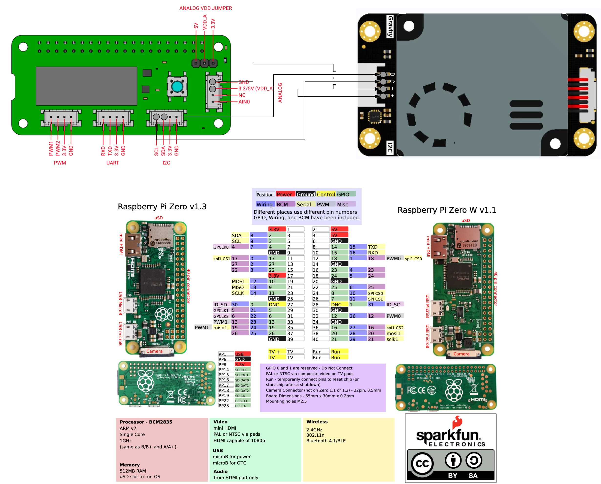
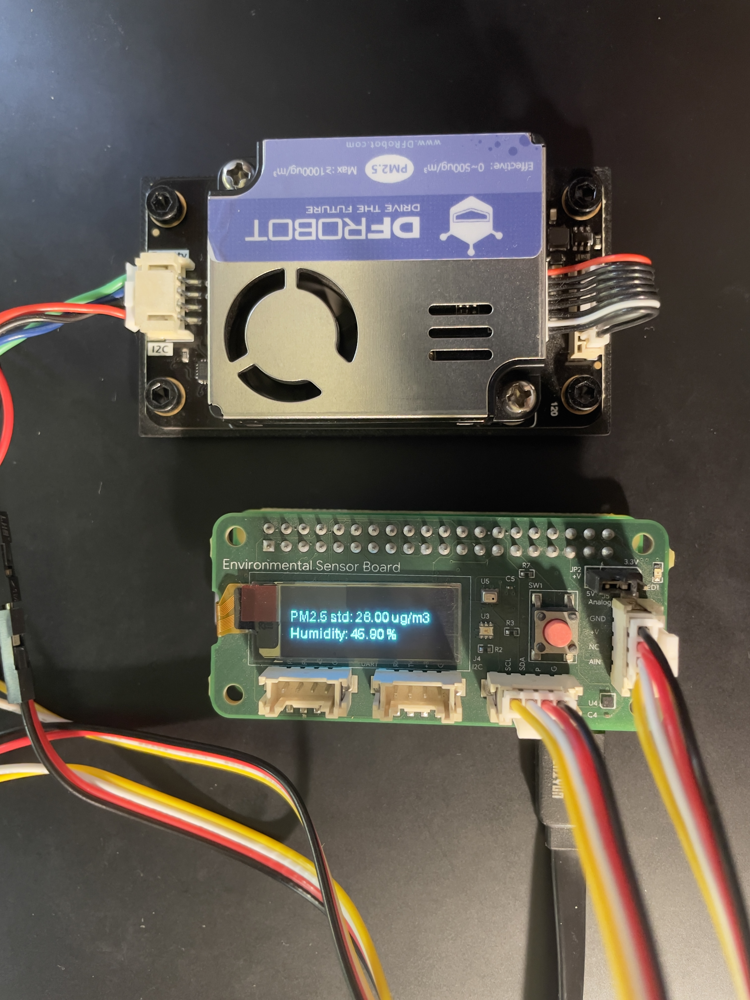

# Coral Environmental Sensor ROS2 (lyrical) Driver For Raspberry Pi Zero W

This package provides a ROS 2 driver for the Coral Environmental Sensor board, allowing you to integrate environmental data (air quality, temperature, humidity, pressure, and light) into your ROS 2 ecosystem.


## Features

- **Air Quality Monitoring**: Reads PM1.0, PM2.5, and PM10 concentrations (Standard and Atmospheric).
- **Environmental Sensing**: Provides readings for:
  - Temperature
  - Humidity
  - Barometric Pressure
  - Ambient Light
- **OLED Display Support**: Optional on-board OLED display to show real-time sensor data and AQI categories.
- **ROS 2 Integration**: Publishes data using the `CoralEnviroMsg` custom message.

## Datasheet




## Demo



## Hardwares

1. [Raspberry Pi Zero W](https://www.raspberrypi.com/products/raspberry-pi-zero-w/)
2. [Coral Environmental Sensor](https://gweb-coral-full.uc.r.appspot.com/products/environmental)
3. [Gravity: PM2.5 Air Quality Sensor](https://www.dfrobot.com/product-2439.html)

## 🛠 Installation

### 1. Hardware Setup (Kernel & Device Tree)

*The Coral Environmental Sensor board includes EEPROM and will allows the Raspberry Pi to automatically load the device tree overlay for the sensor. However, you may need to build and install the kernel modules for the humidity and light sensors to ensure proper functionality.*

#### Build and Install Kernel Modules for Humidity and Light Sensors

1. Check the kernel modules for Environmental Sensor board:
    ```bash
    modinfo ti-ads1015
    modinfo hdc20x0
    modinfo opt3001
    modinfo bmp280
    ```

1. Clone the repository and build the kernel module directories:
    ```bash

    sudo apt-get install python3 python3-pip python3-pil \
        libjpeg-dev zlib1g-dev libfreetype-dev liblcms2-dev \
        libopenjp2-7 libtiff6  build-essential -y

    cd coral_environmental_sensor_ros/coral_enviro_drivers

    mkdir -pv /lib/modules/$(uname -r)/coral-enviro

    # from step 1, if the kernel modules are not found, build and install them.
    # In my case, the kernel version is 6.12.75+rpt-rpi-v6, and the ti-ads1015 and bmp280 modules can be found, but the hdc20x0 and opt3001 modules are not found, so I need to build and install them.

    cd humidity && make && sudo cp -v hdc20x0.ko /lib/modules/$(uname -r)/coral-enviro
    cd light && make && sudo cp -v opt3001.ko /lib/modules/$(uname -r)/coral-enviro
    sudo depmod -a

    # use sudo raspi-config command line to enable I2C
    sudo raspi-config
    ```

### 2. Install dependencies for ros2 lyrical
[Ubuntu (source) Build Guide](https://docs.ros.org/en/humble/Installation/Alternatives/Ubuntu-Development-Setup.html)

### 3. Download ros2 binary packages (armhf)

[ros2-lyrical-armhf-binary](https://github.com/alexchenfeng/coral_environmental_sensor_ros/releases/download/0.0.1/lyrical.tar.gz)

```bash
# download and extract the binary packages
wget https://github.com/alexchenfeng/coral_environmental_sensor_ros/releases/download/0.0.1/lyrical.tar.gz
tar -xzf lyrical.tar.gz && mv lyrical /opt/ros
```

### 4. ROS2 workspave setup

1. Clone this repository into your ros2 workspace and build it using colcon:
    ```bash
    mkdir -p ~/coral_ws/src
    cd ~/coral_ws/src
    git clone <repository-url>
    cd ..
    colcon build --symlink-install
    ```

2. uv install the required python packages:
    ```bash
    # install cargo and uv
    curl -LsSf https://astral.sh/uv/install.sh | sh
    curl --proto '=https' --tlsv1.2 -sSf https://sh.rustup.rs | sh -s -- -y

    cd ~/coral_ws/src/coral_environmental_sensor_ros
    uv venv --python 3.13 --system-site-packages
    uv sync
    ```

## Launching the Sensor Node

### 🚦 Usage

Start the sensor node:

```bash
cd ~/coral_ws/src
source src/coral_environmental_sensor_ros/.venv/bin/activate
export PYTHONPATH=$VIRTUAL_ENV/lib/python3.13/site-packages:$PYTHONPATH
ros2 launch coral_enviro_bringup coral_enviro.launch.py
```

launch file arguments:
```bash
Arguments (pass arguments as '<name>:=<value>'):

    'namespace':
        The namespace to launch the nodes in.
        (default: 'coral_enviro')

    'sensor_board_name':
        The name of the sensor board.
        (default: 'coral_enviro_board_1')

    'enable_oled_display':
        Whether to enable the OLED display on the Enviro board.
        (default: 'true')
```


The node has a parameter to enable/disable the on-board OLED display:
- enable_oled_display (boolean, default: true)

You can change this at runtime:
```bash
ros2 param set /coral_enviro/coral_enviro_board_1   enable_oled_display true
```

## Data Topics
The node publishes to:
- /coral_enviro/{sensor_board_name}/data (Type: coral_environmental_msgs/msg/CoralEnviroMsg)


📊 Message Definitions

### CoralEnviroMsg
| Field | Type | Description |
| :--- | :--- | :--- |
| `temperature` | `sensor_msgs/Temperature` | Temperature in Celsius |
| `air_pressure` | `sensor_msgs/FluidPressure` | Atmospheric pressure |
| `humidity` | `sensor_msgs/RelativeHumidity` | Relative humidity (%) |
| `ambient_light` | `sensor_msgs/Illuminance` | Ambient light intensity |
| `air_quality` | `AirQualityMsg` | PM concentrations |


### AirQualityMsg
Includes standard and atmospheric concentrations for:
- `pm1_0`
- `pm2_5`
- `pm10`
